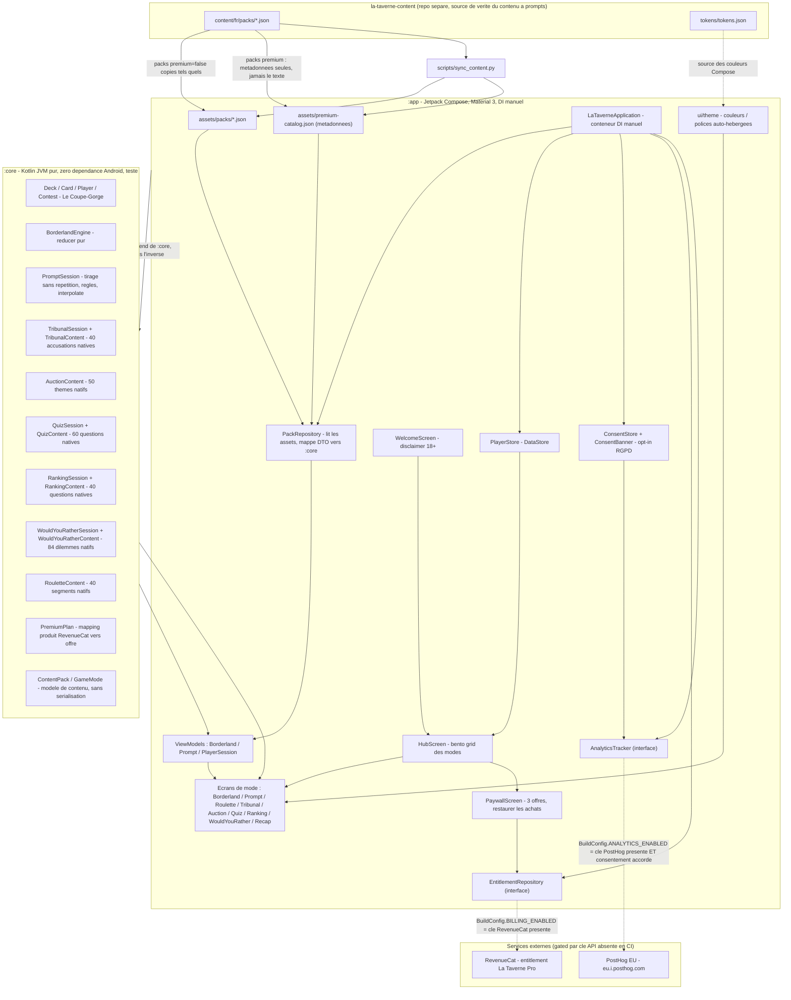

# Architecture - La Taverne Android

Ce document decrit l'architecture reelle de l'application Android La Taverne :
les deux modules Gradle, les couches transverses de monetisation et
d'analytics, et le flux de contenu depuis le repo `la-taverne-content`. Le
diagramme est tenu a jour avec le code, ce n'est pas une decoration.

## Diagramme

## Les couches

- **`:core` (Kotlin JVM pur).** Aucune dependance Android ni serialisation. Il
  contient les moteurs de jeu sous forme de reducers purs et testables
  (`BorderlandEngine`, `PromptSession`, `TribunalSession`, `QuizSession`,
  `RankingSession`, `WouldYouRatherSession`), le modele de contenu
  (`ContentPack`, `GameMode`) et le mapping des offres (`PremiumPlan`). Tourne
  avec `./gradlew :core:test` sans SDK Android.
- **`:app` (Jetpack Compose, Material 3).** L'UI : `WelcomeScreen`,
  `HubScreen` (bento grid qui route vers chaque ecran de mode), les ecrans de
  mode, `PaywallScreen`, et le theme neobrutaliste taverne
  (`ui/theme`). `LaTaverneApplication` sert de conteneur de DI manuel et cable
  chaque dependance comme une interface. La dependance va toujours de `:app`
  vers `:core`, jamais l'inverse.
- **Billing (transverse, gated).** `EntitlementRepository` est une interface :
  `RevenueCatEntitlementRepository` n'est branche que si
  `BuildConfig.BILLING_ENABLED` est vrai (cle `REVENUECAT_API_KEY` presente),
  sinon `StubEntitlementRepository` prend le relais en mode invite. Sans cle,
  aucun appel reseau, l'app reste une application gratuite jouable.
- **Analytics (transverse, gated + consentement).** `AnalyticsTracker` est une
  interface : `PostHogAnalyticsTracker` (instance EU) n'est selectionne que si
  `BuildConfig.ANALYTICS_ENABLED` est vrai, et le SDK n'est jamais initialise
  tant que le joueur n'a pas accepte la banniere (`ConsentBanner` +
  `ConsentStore`). Sinon `NoOpAnalyticsTracker`.

## Flux de contenu

Deux sources coexistent :

1. **Contenu a prompts synchronise.** Les packs FR vivent dans le repo separe
   `la-taverne-content`. `scripts/sync_content.py` copie les packs gratuits
   tels quels dans `assets/packs/*.json` et n'ecrit que les metadonnees des
   packs premium dans `assets/premium-catalog.json` (jamais le texte des
   prompts). `PackRepository` lit ces assets, decode les DTO
   `@Serializable` et les mappe vers les types purs de `:core`. Les modes de
   prompts classiques (Le Taulier, Action ou Verite, Je n'ai jamais, etc.)
   consomment ce contenu.
2. **Contenu embarque natif.** Les modes a moteur propre (Le Pilori, La Criee,
   Quitte ou Trinque, Le Tableau d'Honneur, Tu preferes, La Roue du Destin)
   portent leur contenu directement dans `:core` (`TribunalContent`,
   `AuctionContent`, `QuizContent`, `RankingContent`, `WouldYouRatherContent`,
   `RouletteContent`), hors JSON.

## Pattern "moteur pur teste + contenu natif hors JSON"

Chaque mode a moteur propre suit le meme pattern : une session reducer pure et
deterministe dans `:core` (un `Random` injectable pour les tests), et son
contenu embarque a cote sous forme de constantes Kotlin. Ce contenu natif est
tenu a parite avec la version web (`la-taverne`), ce qui garantit qu'un meme
mode se joue identiquement sur mobile et sur le web. La logique etant separee
de Compose, elle se teste sans SDK Android (100 tests JUnit dans `:core`).

## Principe gated

Billing et analytics sont inactifs par defaut. Les flags
`BuildConfig.BILLING_ENABLED` et `BuildConfig.ANALYTICS_ENABLED` ne passent a
vrai que si la cle API correspondante est presente dans `local.properties` ou
en variable d'environnement. La CI n'ayant jamais ces cles, elle compile et
teste toujours l'app en mode invite, sans secret et sans appel reseau vers
RevenueCat ou PostHog.
